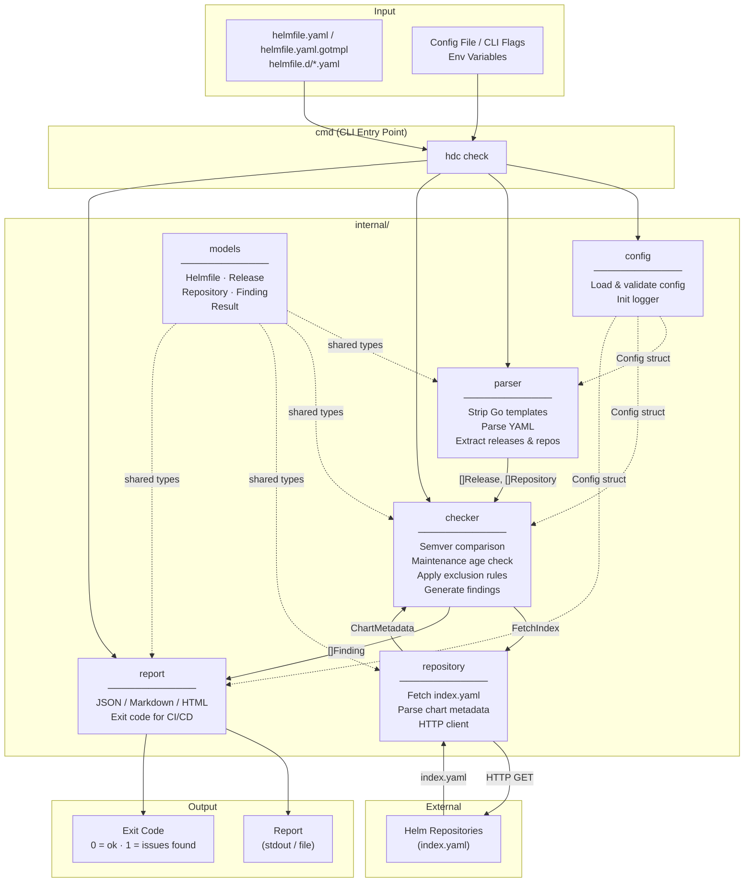

# HDC Architecture Diagram

## Data Flow

1. **CLI** reads config and resolves helmfile path(s)
2. **parser** strips Go template expressions, unmarshals YAML, returns `[]Release` and `[]Repository`
3. **checker** iterates releases, calls **repository** to fetch each repo's `index.yaml`, compares versions and last-updated timestamps against configured thresholds
4. **report** formats `[]Finding` and writes output; exits non-zero if issues are found

## Module Dependency Rules

- `models` has no imports from other internal packages
- `parser`, `repository`, `checker`, `report` import `models` only
- `cmd` is the only package that imports all internal packages
- No circular dependencies permitted
