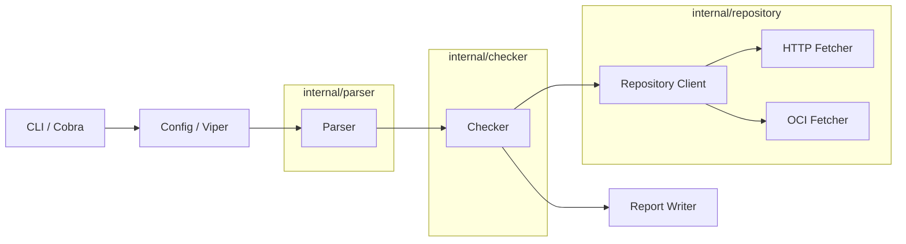
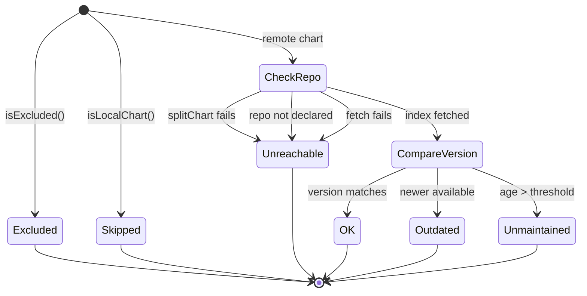

# Helmfile Dependency Checker — Design Document

## Overview

The Helmfile Dependency Checker (hdc) is a standalone CLI tool that verifies Helm chart dependencies declared in helmfile configurations are up-to-date and actively maintained. It parses helmfile.yaml files (including directory structures, Go templates, and sub-helmfile references), queries Helm chart repositories for the latest versions, and generates reports in multiple formats (JSON, Markdown, HTML).

This design covers the full feature set (US-001 through US-012), with particular focus on recent clarifications around CI/CD behavior and three dependency-resolution capabilities:

- **CI/CD Exit Code Semantics**: The checker derives pipeline outcome from finding severity using a three-level exit code contract: `0` for no warnings or errors, `1` for warnings only, and `2` for any errors.
- **US-010 — Local Chart Exclusion**: Automatically skip releases that reference local filesystem charts (`./`, `../`, `/` prefixes) since these cannot be checked against a remote repository.
- **US-011 — OCI Repository Support**: Fetch chart version metadata from OCI-based registries (`oci://` scheme) using the OCI Distribution API, extending the existing HTTP-based repository client.
- **US-012 — OCI Repositories with `oci: true` Flag**: Support helmfile's standard OCI repository definition format using the `oci: true` flag with registry URLs without protocol prefixes.

## Architecture

The system follows a pipeline architecture with clear separation of concerns:



### Data Flow

1. **CLI** parses flags, loads config via Viper
2. **Parser** reads helmfile(s), strips Go templates, resolves sub-helmfiles, merges repos/releases
3. **Checker** iterates releases concurrently:
   - Skips excluded charts and local chart references (US-010)
   - Resolves repository URL from the repo name
   - Dispatches to HTTP or OCI client based on URL scheme or `oci: true` flag (US-011, US-012)
   - Compares versions, checks maintenance age
4. **Exit Code Classifier** derives warning and error counts from findings:
    - `outdated` => warning
    - `unmaintained`, `unreachable` => error
    - `ok`, `skipped` => informational only
5. **Report Writer** formats findings to JSON/Markdown/HTML and may omit `skipped` findings when `ignore_skipped` is enabled

### Key Design Decisions

| Decision | Rationale |
|----------|-----------|
| Local charts detected in Checker, not Parser | Parser's job is structural parsing; the Checker decides what to check. `splitChart` would fail on paths anyway, so early detection avoids confusing error messages. |
| New `StatusSkipped` status | Distinguishes intentionally-skipped releases from OK/excluded ones in reports, while still allowing them to be filtered from output when `ignore_skipped` is enabled. |
| OCI support via separate `FetchOCITags` method on Client | Keeps the existing `FetchIndex` path untouched. OCI registries have a fundamentally different API (tags/list vs index.yaml). |
| Semver filtering of OCI tags | OCI tag lists contain arbitrary strings; only valid semver tags should be considered for version comparison. |
| Three-level exit codes replace legacy fail switches | CI systems need stable semantics that distinguish warnings from failures without additional parsing. A single exit-code strategy is simpler than preserving multiple overlapping modes. |
| No user-configured repository authentication | Authentication is out of scope for this version. The implementation only keeps limited OCI bearer-token challenge compatibility where registries require it for otherwise anonymous access. |

## Components and Interfaces

### Models (`internal/models`)

**Existing** (unchanged):
- `Helmfile` — top-level struct with `Repositories`, `Releases`, `Helmfiles`
- `Release` — `Name`, `Namespace`, `Chart`, `Version`
- `Repository` — `Name`, `URL`
- `SubHelmfileEntry` — `Path`, `Selectors`, `SelectorsInherited`
- `Finding` — check result per release
- `Result` — aggregated findings

**New**:
- `StatusSkipped Status = "skipped"` — added to `result.go` for local chart references
- `Repository.OCI bool` — added to `helmfile.go` for `oci: true` flag support (US-012)

**Derived severity mapping**:
- `StatusOutdated` => warning
- `StatusUnmaintained`, `StatusUnreachable` => error
- `StatusOK`, `StatusSkipped` => informational

### Parser (`internal/parser`)

No changes required for US-010 or US-011. The parser already extracts `Repository.URL` and `Release.Chart` as raw strings. Detection of local paths and OCI schemes happens downstream in the checker and repository client.

For US-012, the parser must extract the `oci: true` field from repository definitions to populate the new `Repository.OCI` boolean field.

### Checker (`internal/checker`)

**New helper**:
```go
// isLocalChart returns true if the chart field is a local filesystem path.
func isLocalChart(chart string) bool {
    return strings.HasPrefix(chart, "./") ||
           strings.HasPrefix(chart, "../") ||
           strings.HasPrefix(chart, "/")
}
```

**Modified `checkRelease` flow**:
1. Check `isLocalChart(rel.Chart)` → return `StatusSkipped` finding
2. Check `isOCIRelease(rel, repoByName)` → use OCI path (detects both `oci://` URLs and `oci: true` flag)
3. Existing HTTP path (splitChart → FetchIndex → compare)

**Exit code classification**:
After all findings are produced, the CLI derives the process exit code from the aggregated result rather than from a boolean `fail-on-outdated` switch:

```go
func classifyExitCode(findings []models.Finding) int {
    hasWarning := false
    hasError := false

    for _, finding := range findings {
        switch finding.Status {
        case models.StatusOutdated:
            hasWarning = true
        case models.StatusUnmaintained, models.StatusUnreachable:
            hasError = true
        }
    }

    switch {
    case hasError:
        return 2
    case hasWarning:
        return 1
    default:
        return 0
    }
}
```

`StatusOK` and `StatusSkipped` never affect the exit code.

**OCI release detection**:
```go
// isOCIRepo returns true if the repository URL uses the oci:// scheme.
func isOCIRepo(repoURL string) bool {
    return strings.HasPrefix(repoURL, "oci://")
}

// isOCIFromFlag returns true if the repository has oci: true set.
func isOCIFromFlag(repo models.Repository) bool {
    return repo.OCI
}
```

For OCI releases, the chart name is extracted from the OCI URL rather than using `splitChart`. The OCI URL format is `oci://registry.example.com/path/to/chart`, and the chart name is the last path segment. For repositories defined with `oci: true`, the URL is constructed by prefixing the provided URL with `oci://`.

### Repository Client (`internal/repository`)

**Extended `Client` interface**:
```go
type Client interface {
    FetchIndex(repoURL string) (*Index, error)
    FetchOCITags(ociURL string) (*Index, error)
}
```

**`FetchOCITags` implementation**:
1. Parse the `oci://` URL to extract registry host and repository path
2. Construct the OCI Distribution API URL: `https://{host}/v2/{repo}/tags/list`
3. HTTP GET the tags list endpoint
4. Parse the JSON response: `{"name":"...","tags":["1.0.0","1.1.0",...]}`
5. Filter tags to valid semver only
6. Build an `Index` with a single entry keyed by the chart name (last path segment)
7. Each tag becomes a `ChartVersion` with `Created` set to zero time (OCI tags/list doesn't provide timestamps)
8. If the registry responds with an OCI bearer-token challenge, the client may perform the anonymous token exchange and retry the request with an `Authorization: Bearer ...` header

**OCI URL parsing helper**:
```go
// parseOCIURL extracts host, repo path, and chart name from an oci:// URL.
// Example: oci://registry.example.com/charts/mychart
//   → host: registry.example.com, repo: charts/mychart, chart: mychart
func parseOCIURL(ociURL string) (host, repo, chartName string, err error)
```

### Report (`internal/report`)

Existing report writers already iterate `Result.Findings` and render based on `Status`. The new `StatusSkipped` value needs to be handled in each writer:
- **JSON**: included as `"status": "skipped"`
- **Markdown**: row with "skipped" badge
- **HTML**: row with neutral/grey styling

By default, skipped releases are included for transparency. When `ignore_skipped` is enabled, the reporting layer filters out `StatusSkipped` findings before serialization so both human-readable and machine-readable outputs omit them consistently.

Human-readable reports must also preserve the warning-versus-error distinction using distinct visual indicators. The current Markdown mapping is:
- `ok` => `✅`
- `outdated` => `⚠️`
- `unmaintained` => `🔴`
- `unreachable` => `❌`
- `skipped` => `⏭️`

## Configuration

Configuration is loaded from defaults, config file, and CLI flags, with this precedence order:

1. CLI flags
2. Config file
3. Defaults

Relevant options for the clarified behavior are:

- `output.format` / `--output`: `json`, `markdown`, `html`
- `output.file` / `--output-file`: write report to file
- `output.ignore_skipped` / `--ignore-skipped`: omit `StatusSkipped` findings from report output
- `checker.max_age_months` / `--max-age`: threshold for `unmaintained`
- `checker.concurrent_requests` / `--concurrent`: concurrency limit
- `repositories.timeout_seconds` / `--timeout`: network timeout

The previous `fail_on_outdated` / `--fail-on-outdated` mode is removed from the target design. Exit behavior is always derived from severity classification.

## Data Models

### Release Check Flow State Machine



### OCI Tags Response

```json
{
  "name": "charts/mychart",
  "tags": ["1.0.0", "1.1.0", "2.0.0-rc1", "latest"]
}
```

Only tags matching semver pattern (`X.Y.Z` with optional `v` prefix and pre-release suffix) are considered. Non-semver tags like `latest` are ignored.

### Status Values

| Status | Meaning |
|--------|---------|
| `ok` | Chart is up-to-date and maintained |
| `outdated` | Newer version available; classified as a warning |
| `unmaintained` | Latest release exceeds age threshold; classified as an error |
| `unreachable` | Repository or chart not accessible; classified as an error |
| `skipped` | Local chart reference, not checked (NEW) |

### Exit Code Contract

| Exit Code | Condition |
|-----------|-----------|
| `0` | No warnings or errors |
| `1` | One or more warnings and no errors |
| `2` | One or more errors, regardless of warnings |


## Correctness Properties

*A property is a characteristic or behavior that should hold true across all valid executions of a system — essentially, a formal statement about what the system should do. Properties serve as the bridge between human-readable specifications and machine-verifiable correctness guarantees.*

### Property 1: Parser extracts all releases and repositories

*For any* valid helmfile YAML containing N releases and M repositories, parsing it should produce a `Helmfile` with exactly N releases and M repositories, each preserving the original chart, version, name, and URL fields.

**Validates: Requirements AC-001.2**

### Property 2: Semver comparison correctness

*For any* two valid semantic version strings A and B where A > B (by semver ordering), `isNewer(A, B)` should return true, and `isNewer(B, A)` should return false. For equal versions, `isNewer(A, A)` should return false.

**Validates: Requirements AC-002.2, AC-011.5**

### Property 3: Unreachable repository produces StatusUnreachable

*For any* release whose repository (HTTP or OCI) returns an error during index/tag fetching, the resulting finding should have `StatusUnreachable` and a non-empty message containing the repository identifier.

**Validates: Requirements AC-003.3, AC-011.3**

### Property 4: Maintenance age threshold detection

*For any* chart whose latest version has a `Created` timestamp older than `maxAgeMonths` from now, the checker should produce a finding with `StatusUnmaintained`. For any chart whose latest version is within the threshold, the status should not be `StatusUnmaintained`.

**Validates: Requirements AC-004.2**

### Property 5: Report contains all findings with status

*For any* set of findings, each report format (JSON, Markdown, HTML) should produce output that contains every finding's release name and status string.

**Validates: Requirements AC-005.1, AC-005.2**

### Property 6: Exit code classification reflects finding severity

*For any* Result, exit code classification should return `0` when all findings are `ok` or `skipped`, `1` when at least one finding is `outdated` and none are `unmaintained` or `unreachable`, and `2` when at least one finding is `unmaintained` or `unreachable`.

**Validates: Requirements AC-006.1, Distinct Exit Codes acceptance criteria**

### Property 7: Excluded charts are skipped

*For any* release whose chart name or release name matches an entry in `ExcludeCharts`, the checker should return a finding with `StatusOK` and message "excluded", without making any repository requests.

**Validates: Requirements AC-007.3**

### Property 8: Sub-helmfile merge preserves all releases and repositories

*For any* parent helmfile referencing N sub-helmfiles (via glob or explicit path), the merged result should contain the union of all releases and repositories from the parent and all sub-helmfiles.

**Validates: Requirements AC-009.3**

### Property 9: Missing sub-helmfile path produces descriptive error

*For any* helmfile referencing a non-existent explicit path in `helmfiles:`, the parser should return an error whose message contains the missing file path.

**Validates: Requirements AC-009.5**

### Property 10: Local chart detection

*For any* string starting with `./`, `../`, or `/`, `isLocalChart` should return true. *For any* string that does not start with these prefixes (including strings like `repo/chart`, `oci://...`, or plain names), `isLocalChart` should return false.

**Validates: Requirements AC-010.1, AC-010.2, AC-010.7**

### Property 11: Local chart releases produce StatusSkipped

*For any* release whose chart field is a local path (detected by `isLocalChart`), the checker should produce a finding with `StatusSkipped` and should not attempt any repository lookup.

**Validates: Requirements AC-010.1, AC-010.2, AC-010.3, AC-010.6**

### Property 14: Ignoring skipped findings only affects report output

*For any* set of findings, enabling `ignore_skipped` should remove only `StatusSkipped` findings from serialized report output and must not change warning counts, error counts, or derived exit code.

**Validates: Requirements AC-010.4, AC-010.5, AC-010.6**

### Property 12: OCI tag filtering and latest version selection

*For any* list of OCI tags containing a mix of valid semver strings and non-semver strings (e.g. "latest", "dev"), the OCI client should filter to only valid semver tags and return the highest version as the latest.

**Validates: Requirements AC-011.2**

### Property 13: OCI repository detection

*For any* URL string starting with `oci://`, `isOCIRepo` should return true. *For any* URL string starting with `http://`, `https://`, or any other scheme, `isOCIRepo` should return false.

**Validates: Requirements AC-011.4**

### Property 15: OCI repository flag detection

*For any* Repository struct with `OCI: true`, `isOCIFromFlag` should return true. *For any* Repository struct with `OCI: false` or unset, `isOCIFromFlag` should return false.

**Validates: Requirements AC-012.1, AC-012.2**

### Property 16: OCI repositories with flag use same fetching logic

*For any* release whose repository has `oci: true` set, the checker should use the same OCI fetching and version comparison logic as releases with `oci://` prefixed repository URLs.

**Validates: Requirements AC-012.3, AC-012.4, AC-012.5**

## Error Handling

### Parser Errors

| Condition | Behavior |
|-----------|----------|
| File not found | Return error with file path |
| Invalid YAML | Return error with file path and parse details |
| Circular sub-helmfile reference | Return error identifying the cycle |
| Missing explicit sub-helmfile path | Return error with missing path (AC-009.5) |
| Glob matches zero files | Continue without error (AC-009.6) |

### Checker Errors

| Condition | Behavior |
|-----------|----------|
| `splitChart` fails (no `/` separator) | Finding with `StatusUnreachable` |
| Repository not declared in helmfile | Finding with `StatusUnreachable` |
| HTTP repository fetch fails | Finding with `StatusUnreachable`, log warning |
| OCI registry unreachable | Finding with `StatusUnreachable`, message includes OCI URL |
| Chart not found in index | Finding with `StatusUnreachable` |
| Local chart reference | Finding with `StatusSkipped` (not an error) |

### Repository Authentication Limitations

| Condition | Behavior |
|-----------|----------|
| HTTP/HTTPS repository requires configured credentials | Unsupported in this version; request fails and is surfaced as unreachable |
| OCI registry issues bearer-token challenge for anonymous pull | Client may exchange challenge for token and retry |
| OCI registry requires interactive or user-supplied credentials | Unsupported in this version; request fails and is surfaced as unreachable |

### Repository Client Errors

| Condition | Behavior |
|-----------|----------|
| HTTP non-200 response | Return error with status code |
| Body read failure | Return error wrapping IO error |
| Index YAML parse failure | Return error wrapping parse error |
| OCI tags/list non-200 response | Return error with status code and OCI URL |
| OCI tags/list invalid JSON | Return error wrapping JSON parse error |
| No valid semver tags in OCI response | Return error indicating no versions found |

## Testing Strategy

### Dual Testing Approach

The project uses both unit tests and property-based tests:

- **Unit tests**: Specific examples, edge cases, error conditions, integration points. Use `testify/assert` and `testify/require` per project conventions.
- **Property-based tests**: Universal properties across generated inputs. Use the `pgregory.net/rapid` library for Go property-based testing.

### Property-Based Testing Configuration

- **Library**: `pgregory.net/rapid` (Go-native, no external dependencies beyond the module)
- **Minimum iterations**: 100 per property test
- **Tag format**: Each property test must include a comment: `// Feature: helmfile-dependency-checker, Property {N}: {title}`
- **Each correctness property is implemented by a single property-based test**

### Unit Test Focus

- Specific helmfile parsing examples (single file, directory, gotmpl)
- HTTP client mock-based tests for repository fetching
- OCI client mock-based tests for tag fetching
- Report format validation (valid JSON, valid Markdown structure)
- CLI flag binding, precedence, and exit code behavior
- Edge cases: empty helmfile, zero releases, circular references

### Property Test Focus

- Property 1: Generate random helmfile YAML, verify parse preserves all fields
- Property 2: Generate random semver pairs, verify comparison correctness
- Property 3: Generate releases with failing repos, verify StatusUnreachable
- Property 4: Generate charts with random timestamps, verify age threshold
- Property 5: Generate random findings, verify report contains all entries
- Property 6: Generate random Result, verify exit code classification consistency
- Property 7: Generate releases matching exclusion rules, verify skip behavior
- Property 8: Generate parent + sub-helmfile structures, verify merge completeness
- Property 9: Generate non-existent paths, verify error contains path
- Property 10: Generate strings with/without path prefixes, verify isLocalChart
- Property 11: Generate local-path releases, verify StatusSkipped without repo calls
- Property 12: Generate mixed semver/non-semver tag lists, verify filtering and latest selection
- Property 13: Generate URLs with various schemes, verify isOCIRepo detection
- Property 14: Generate mixed findings, verify `ignore_skipped` only affects serialized output
- Property 15: Generate Repository structs with random OCI flag values, verify isOCIFromFlag detection
- Property 16: Generate releases with `oci: true` repositories, verify same OCI logic as `oci://` URLs
